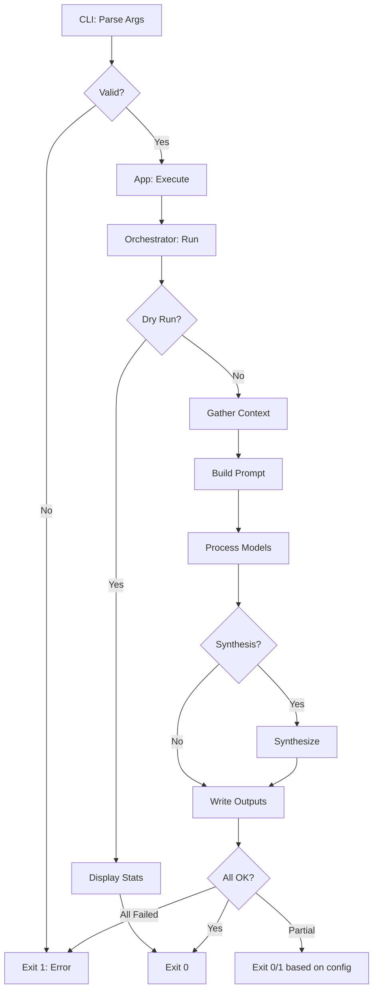
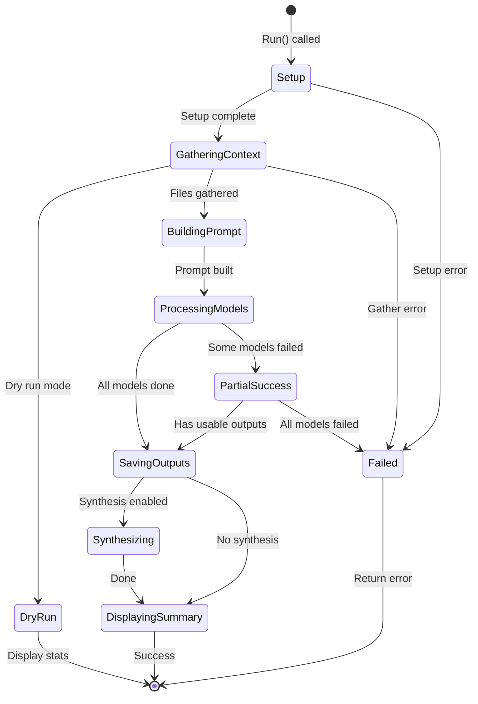
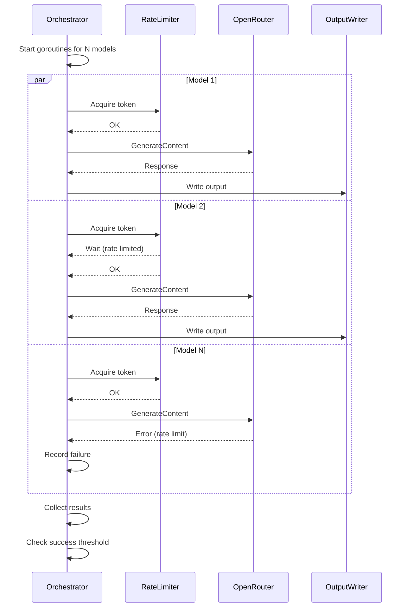
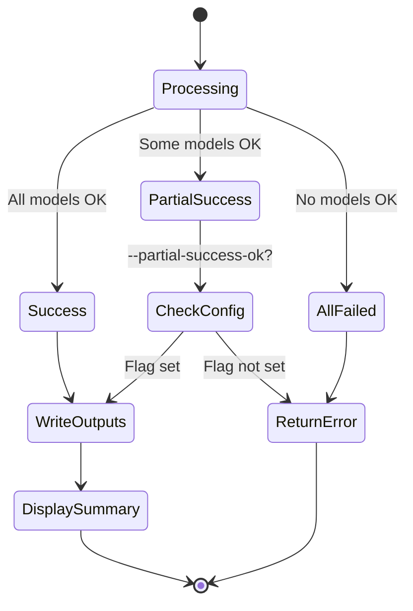

# Execution Flow

This document describes thinktank's main execution flow with state diagrams.

## High-Level Flow

## Orchestrator State Machine

The orchestrator transitions through these states during execution:

## Model Processing (Concurrent)

Each model is processed concurrently with rate limiting:

## Error Handling States

## Key Decision Points

1. **Dry Run Check**: Short-circuits before any API calls
2. **Partial Success**: Configurable behavior via `--partial-success-ok`
3. **Synthesis**: Only runs if `--synthesis` flag or auto-selected for large inputs
4. **Rate Limiting**: Per-model limits for models with concurrency restrictions
